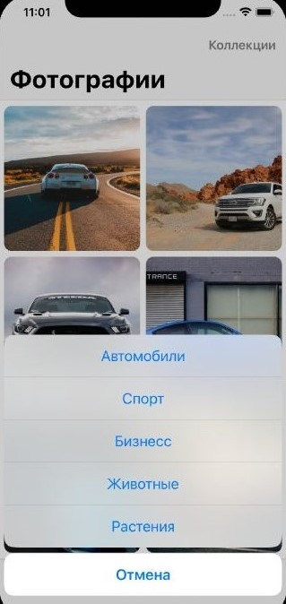

**Hello!**

**Представляю Вам скрины и возможности моего приложения SPACE!**

    
    Фотографии 
     

- Главный экран

1. Экран фотографий загруженных по сети, API был взял от "Unsplash".
2. Использован collelctionView.

---

- Экран детальной информации

1. Открывается при нажатии на ячейку, с небольшой анимацией
2. Показывается инфорация о фотографии:

- Место, которое указал автор фотографии.
- Автор фотографии.
- Количество лайков.

3. Все данные загружаются из API.

---

    
    Заметки 
     

- Главный экран

1. Кнопка "+" добавления заметки.
2. Актуальная дата на сегодняшний день.
3. Прогресс завершенных заметок.

---

- Окно создания заметки

1. Заметке можно дать название.
2. Написать основной текст.
3. Задать цвет заметке, нажав на цветовой кружок, для выделения его из остального спписка.
4. Также показывается актуальная дата и время создания заметки.
5. Кнопка "Отменить" возвращает на главный экран, без принятий изменений.
6. Кнопка "Сохрнаить" сохраняет заметку в UserDefaults.

---

- Главнй экран после добавления заметки

1. После выполнения задания, заметке можно поставить галку и твой прогресс увеличивается.
2. Нажав на ячейку открывается заметка и ее можно:
   - редактировать название и основной текст.
   - поменять цвет.
   - удалить.
3. Если нажать на отмену, то вернемся на главный экран, никакаие изменения не будут сохранены.
4. Заметки сортируются по дате создания, то что создано последним помещается сверху.

---

- Экран удаления заметки

1.  Кнопка "Удалить заметку" появлется только тогда, когда редактируем заметку.
2.  При удалении заметки показывается "алерт" с названием заметки.
3.  После удаления возвращаемся на главный экран.

---

Это первая версия приложения, далее будут добавленые новые возможности.

- Экран Фотографии написан на VIPER.
- Использован SnapKit.
- Использован API от Unsplash.
- Будет добавлен режим выбора категории фотографий.
- Будет добавлена Light/Dark тема.
