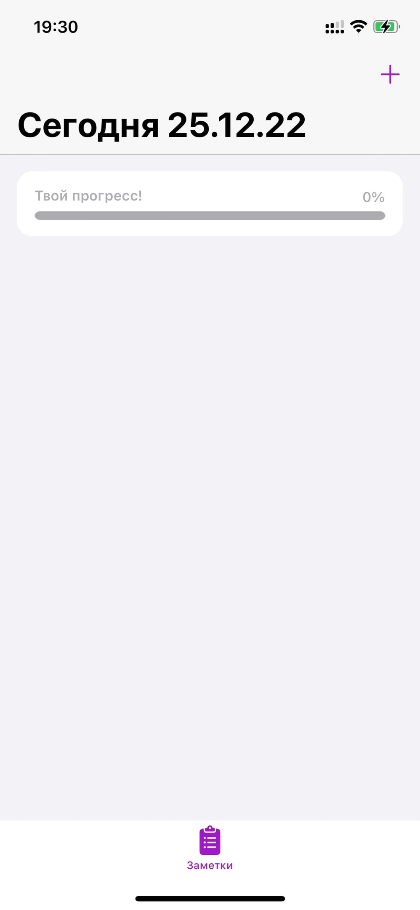
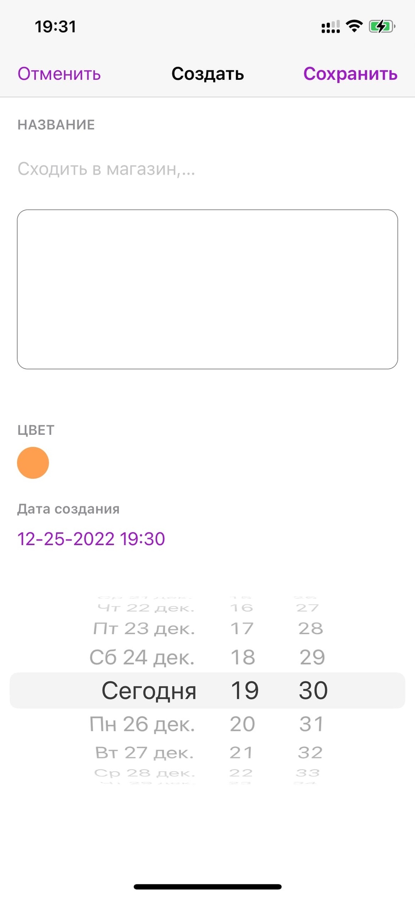
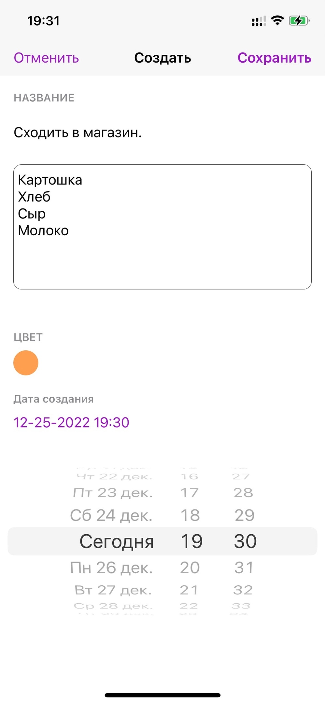
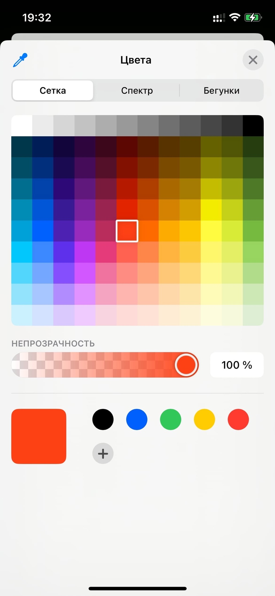
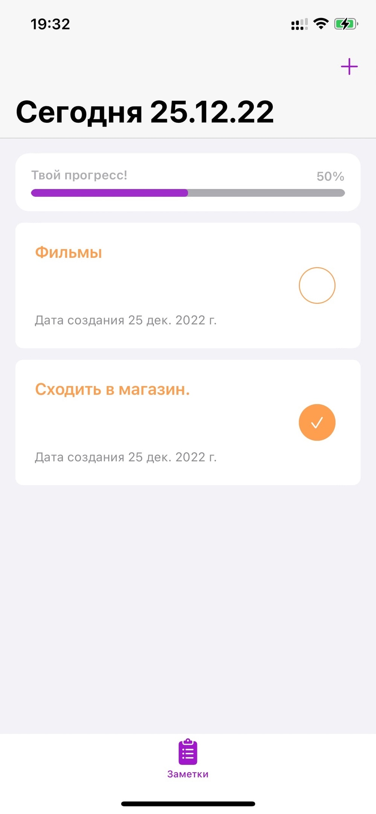
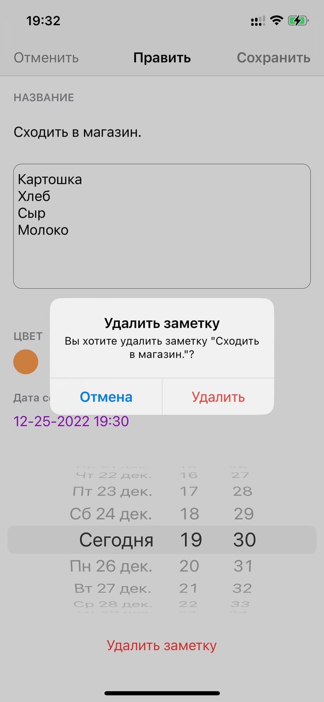
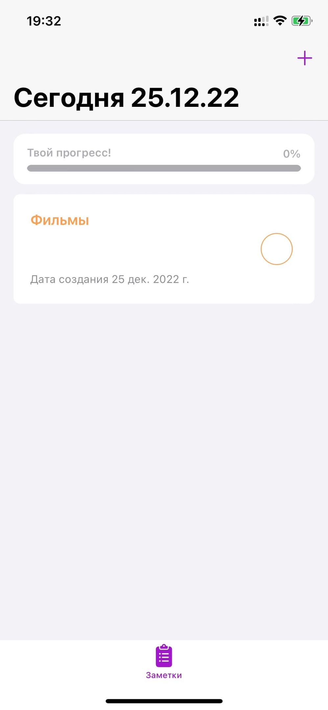

**Hello!**

**Представляю Вам скрины и возможности моего приложения SPACE!**

    
    Заметки 
     

- Главный экран

1. Кнопка "+" добавления заметки
2. Актуальная дата на сегодняшний день
3. Прогресс завершенных заметок

---

- Окно создания заметки

1. Заметке можно дать название
2. Написать оснвоной текст
3. Задать цвет заметке, нажав на цветовой кружок, для выделения его из остального спписка
4. Также показывается актуальная дата и время создания заметки
5. Кнопка "Отменить" возвращает на главный экран, без принятий изменений
6. Кнопка "Сохрнаить" сохраняет заметку в UserDefaults

---

- Главнй экран после добавления заметки

1. После выполнения задания заметке можно поставить глаку и твой прогресс увелится
2. Нажав на ячейку открывается заметка и ее можно:
   - редактировать название и основной текст
   - поменять цвет
   - удалить
3. Если нажать на отмену, то вернемся на главный экран, никакаие изменения не будут сохранены.
4. Заметки сортируются по дате создания, то что создано последним помещается сверху

---

- Экран удаления заметки

1.  Кнопка "Удалить заметку" появлется только тогда, когда редактируем заметку
2.  При удалении заметки показывается "алерт" с названием заметки
3.  После удаления возвращаемся на главный экран

---

- Это первая версия приложения, далее будут добавленые новые возможности.
- AutoLayout будет заменен на SnapKit.
- Будет переписан на VIPER или MVVM.
- Будет добавлена Light/Dark тема.
- Также буду новые экраны!
